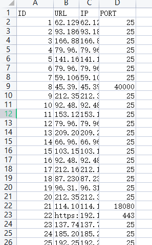

# Search Tools
## 使用
1. 一个基于Python tkinter开发的图形化测绘工具，目前已完成调用fofa api的测绘查询
2. 计划中将支持quake、hunter等平台的图形化测绘
3. 配置文件为config.yaml，使用前请先配置相关测绘的邮箱、api_key等
4. 修改config.yaml中http下的proxy字段设置代理，格式如http://127.0.0.1:1080
5. 界面如下图
    
    
6. 在上面的输入框中输入查询语法，如“后台管理”
    
    
7. 点击左下角的导出按钮可导出查询到的数据
8. 点击右下角的清空可将显示框中的数据清空
9. 每查询一次，显示框会将上一次查询的数据清空

